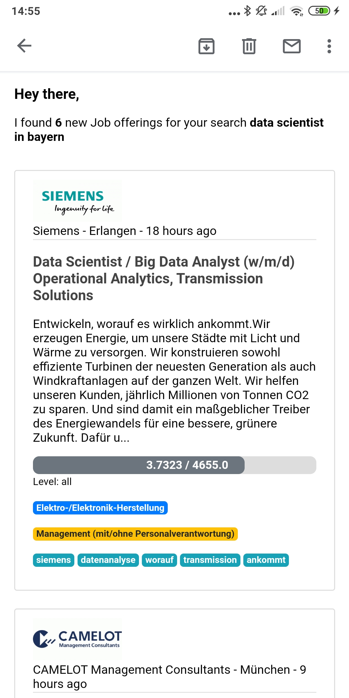

### Job search project

This repository makes it possible to crawl, enrich and mail job postings from linkedin.




#### How to get started

In this section you will find all the preceding steps that need to be taken to ensure that the automated process works as intended.


##### Create `config.json`
Even though this project is designed to run fully automated it requires some information about the jobs you want to be informed by. These kind of settings are located in the `config.json` file which you have to create on your own. The file should look like this

``` json
{
    "keywords": ["data scientist", "technical consultant"],
    "location": ["münchen", "berlin"],
    "gmail_username": "joe.doe@gmail.com",
    "gmail_password": "secret password",
    "recipient": "joe.doe@gmail.com"
}

```
With the list for `keywords` you specify all the job positions you are looking for. With `location` you specify the location for a particular keyword (both list have to be the same length). So the example `config.json` file is searching for data science jobs in munich and for technical consolutant jobs in berlin. 

`gmail_username` and `gmail_password` should state the gmail account you want to use to send the job mails. To ensure you can send mails from this account you have to change a setting. Activate the switch under *Security -> Less secure app access* in order to allow access for the app. 


##### Virtual Enviroment and Packages
After cloning the repository create a new virtual enviroment by running the command (on a linux machine)

``` console
python3 -m venv env
```

after that activate the virtual enviroment

``` console
source env/bin/activate
```

the required packages for this project can be installed in this fresh enviroment via the command (this can take a while)

``` console
pip install -r requirements.txt
```

##### nltk Package
the usage of the nltk package furthermore requires to run the following code in python

``` python
import nltk
nltk.download('punkt')
```

##### Set up Airflow

To initialize the database backend for airflow run the command

``` console
airflow initdb
```


After that create a folder for the Airflow DAGs and copy the DAG file for this project to the right place

``` console 
mkdir ~/airflow/dags
cp automate.py ~/airflow/dags
```

Now we can spin up an Airflow webserver and scheduler by running the following commands in **seperate** windows

```
airflow webserver
airflow scheduler
```

And finally we can trigger and unpause the DAG file to automatically crawl, enrich and mail the jobs correspondingly to the settings in the `config.json` file

``` console
airflow trigger_dag 'job_postings'
airflow unpause 'job_postings'
```
